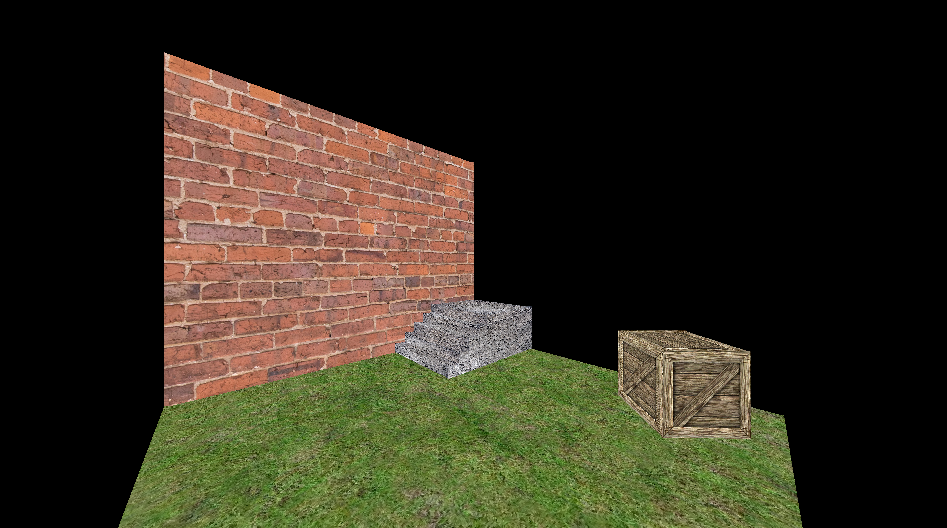
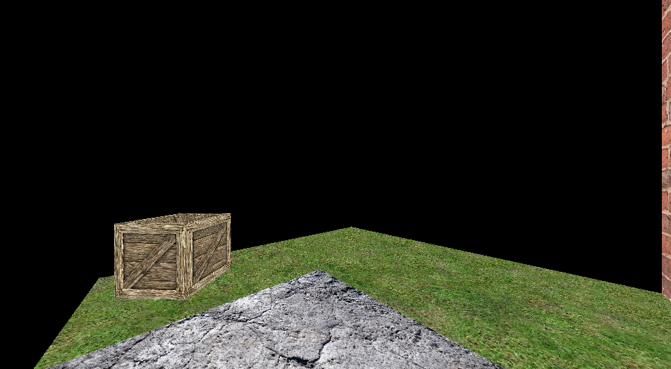

# Overview
This is a 3d game engine that I started working on, starting May 2023. It uses no external libraries. It has the following features:
- Software renderer
- Importing .bmp image textures
- Importing .obj game objects
- Physics engine (in development)

# Demo
A demo video can be found [here.](https://youtu.be/sMuDvSHr05I)\
Also, here are some pictures of the scene:



# Run
To build and run the project, run the follow batch files in the order given:
```
configure.bat
build.bat
run.bat
```